# 0x02. Calculus

### Description

This project is about differential and integral calculus concepts. Solving some multiple choice questions and programming derivate and integrate functions.

### General Objectives

* Summation and Product notation
* What is a series?
* Common series
* What is a derivative?
* What is the product rule?
* What is the chain rule?
* Common derivative rules
* What is a partial derivative?
* What is an indefinite integral?
* What is a definite integral?
* What is a double integral?

### Mandatory Tasks

| File | Description |
| ------ | ------ |
| [0-sigma_is_for_sum](0-sigma_is_for_sum) | Solution to:  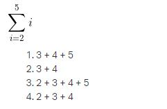 |
| [1-seegma](1-seegma) | Solution to:  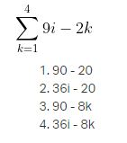 |
| [2-pi_is_for_product](2-pi_is_for_product) | Solution to:  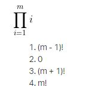 |
| [3-pee](3-pee) | Solution to:  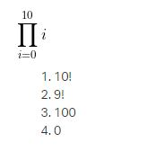 |
| [4-hello_derivatives](4-hello_derivatives) | Solution to:  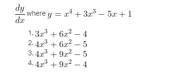 |
| [5-log_on_fire](5-log_on_fire) | Solution to:  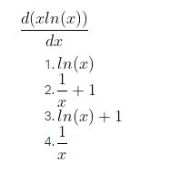 |
| [6-voltaire](6-voltaire) | Solution to:  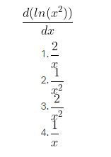 |
| [7-partial_truths](7-partial_truths) | Solution to:  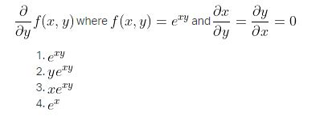 |
| [8-all-together](8-all-together) | Solution to:  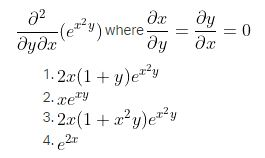 |
| [9-sum_total.py](9-sum_total.py) | Function that calculates:  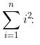 |
| [10-matisse.py](10-matisse.py) | Function that calculates the derivative of a polynomial. |
| [11-integral](11-integral) | Solution to:  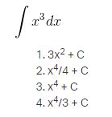 |
| [12-integral](12-integral) | Solution to:  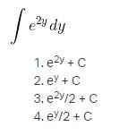 |
| [13-definite](13-definite) | Solution to:  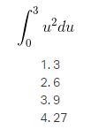 |
| [14-definite](14-definite) | Solution to:  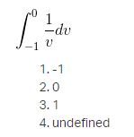 |
| [15-definite](15-definite) | Solution to:  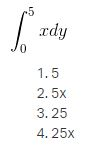 |
| [16-double](16-double) | Solution to:  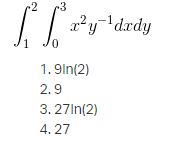 |
| [17-integrate.py](17-integrate.py) | Function that calculates the integral of a polynomial. |
