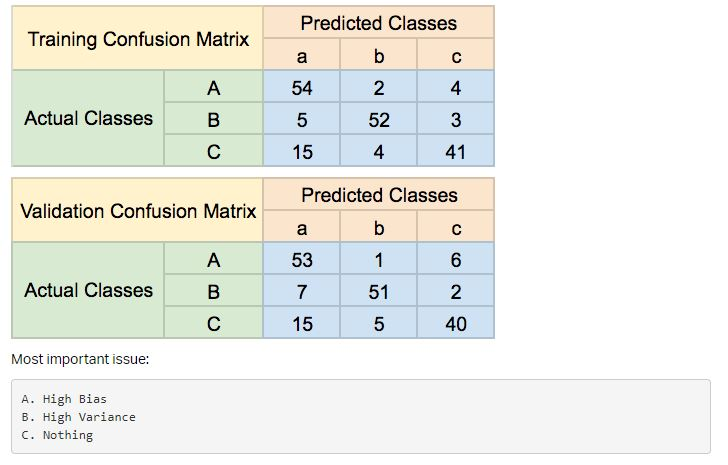

# 0x04. Error Analysis

### Description

This project is about error analysis.

### General Objectives

* What is the confusion matrix?
* What is type I error? type II?
* What is sensitivity? specificity? precision? recall?
* What is an F1 score?
* What is bias? variance?
* What is irreducible error?
* What is Bayes error?
* How can you approximate Bayes error?
* How to calculate bias and variance
* How to create a confusion matrix

### Mandatory Tasks

| File | Description |
| ------ | ------ |
| [0-create_confusion.py](0-create_confusion.py) | Creates a confusion matrix. |
| [1-sensitivity.py](1-sensitivity.py) | Calculates the sensitivity for each class in a confusion matrix. |
| [2-precision.py](2-precision.py) | Calculates the precision for each class in a confusion matrix. |
| [3-specificity.py](3-specificity.py) | Calculates the specificity for each class in a confusion matrix. |
| [4-f1_score.py](4-f1_score.py) | Calculates the F1 score of a confusion matrix. |
| [5-error_handling](5-error_handling) | Text file to answer to some scenarios 1. High Bias, High Variance, 2. High Bias, Low Variance, 3. Low Bias, High Variance, 4. Low Bias, Low Variance. |
| [6-dropout_create_layer.py](6-dropout_create_layer.py) | Text file determine what the most important issue is and write the lettered answer in the file  . |
